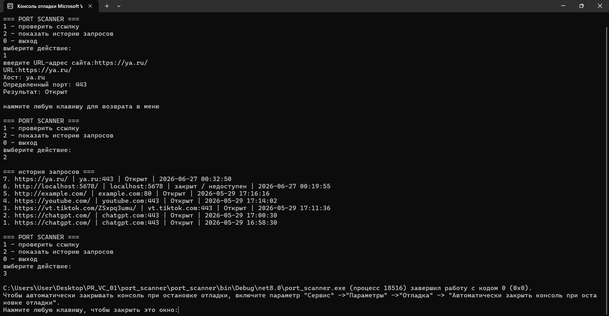

# Port Scanner

A simple console-based port scanner written in C#.

The application accepts a website address, extracts the host and port, checks TCP port availability, and stores scan results in a local SQLite database.

## Tech Stack

- C#
- .NET
- TCP networking
- SQLite
- Console application

## Features

- URL input from the console
- Automatic `http://` prefix handling
- Host and port extraction using `Uri`
- TCP connection check with timeout
- Local scan history storage using SQLite
- Console menu for scanning and viewing history

## Repository structure

```text
port-scanner/
├── README.md
├── src/
│   └── Program.cs
├── database/
│   └── scan_history.db
└── screenshots/
    └── console-demo.png
```

## How it works

```text
User input
    |
    v
URL parsing
    |
    v
Host and port detection
    |
    v
TCP connection check
    |
    v
SQLite scan history
```

## Database

The application stores scan results locally in a SQLite database:

```text
database/scan_history.db
```

The database contains a `scan_history` table with:

- URL
- host
- port
- scan result
- scan time

The `.db` file can be opened with DB Browser for SQLite or any SQLite-compatible tool.

## Screenshot



## What I learned

During this project I practiced:

- basic TCP networking in C#
- working with `TcpClient`
- parsing URLs
- using SQLite in a console application
- storing and reading scan history
- building a console menu
